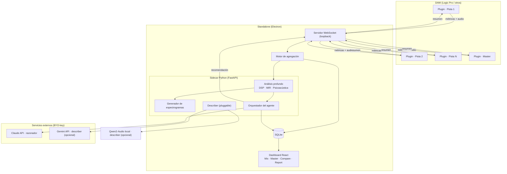

# Documento de implementación — Audire

> **Audire** (latín, "escuchar") es el codename provisional del proyecto: un sistema open-source (GPLv3, sin fines de lucro) de asistencia a mezcla y mastering compuesto por un **plugin** de análisis transparente y una **aplicación standalone** que agrega, razona con IA y recomienda. Pensado primero para Logic Pro, funciona en cualquier DAW que soporte AU o VST3.

---

## 0. Visión en una frase

El plugin mide; el standalone piensa. Se ponen instancias del plugin en cada pista y en el master; cada una captura audio y métricas y las empuja a la standalone, que arma el panorama global del proyecto, lo razona con Claude (cerebro) y opcionalmente describe la música con Gemini o Qwen (oído semántico), y devuelve recomendaciones de cadena por pista y de master — sin tocar la sesión del DAW.

---

## 1. Decisiones de arquitectura fijadas

| Decisión | Elección | Motivo |
|---|---|---|
| Licencia | GPLv3, público/gratis/sin fines de lucro | Compatible con dependencias copyleft (JUCE-GPL, Essentia-AGPL) |
| Formato de plugin | AU (AUv2 `.component`) + VST3 | AU para Logic; VST3 gratis vía JUCE para otros DAWs |
| Framework de plugin | JUCE bajo GPLv3 | Gratis para open source; multi-formato desde un solo código |
| Backend de análisis | Electron + sidecar Python (FastAPI) | Mejor ecosistema de audio; frontend en la zona fuerte del equipo |
| Entrada de audio | El plugin captura y envía audio al standalone | Todo dentro del DAW, sin export manual |
| Cerebro (razonador) | Claude API, bring-your-own-key | El usuario pone su propia key de Anthropic |
| Describer (semántico) | Pluggable: Gemini API **o** Qwen2-Audio local | El usuario elige según hardware/privacidad |
| Transporte plugin↔standalone | WebSocket sobre loopback (127.0.0.1) | Estructurado, bidireccional, simple en C++/JS/Python |
| Almacenamiento | SQLite | Local, sin servidor, ya familiar para el equipo |

### 1.1 Justificación del backend (la pregunta abierta)

La elección de **Python como sidecar de análisis** no es por gusto sino por dependencias: las librerías que dan el diferencial del producto viven en Python/C++.

- **Loudness/True Peak:** `pyloudnorm`, `libebur128` (bindings).
- **Espectral/MIR:** `librosa`, `Essentia` (C++ con bindings Python).
- **Psicoacústica:** `MoSQITo` (loudness Zwicker, sharpness, roughness, fluctuation strength) — la capa "oído crítico". No existe equivalente maduro en Node.
- **Espectrogramas como imagen:** `librosa` + `matplotlib`/`numpy` → PNG para el agente.

En Node puro habría que reimplementar a mano los modelos psicoacústicos validados contra ISO 532-1 / DIN 45692, lo cual es inviable y frágil. Electron aporta el shell multiplataforma y aloja el frontend (React/Next.js), donde el equipo es fuerte. El sidecar Python se empaqueta dentro del Electron (ver §6.3) y se comunica por HTTP/WebSocket local. Costo: el empaquetado de Python en Electron tiene fricción conocida (firma/notarización), tratado como riesgo en §13.

---

## 2. Arquitectura general



Flujo resumido: plugins → WebSocket → agregación → (SQLite + análisis Python) → agente Claude → recomendación → de vuelta a SQLite/UI y al plugin.

---

## 3. El plugin (JUCE · AU + VST3)

### 3.1 Responsabilidades

1. Tap transparente del audio en su posición de la cadena (no altera la señal, latencia cero).
2. Medición en tiempo real de las métricas baratas para UI local y telemetría continua.
3. Captura de audio bajo demanda (buffer/pasada completa) y envío al standalone para análisis profundo.
4. Identidad: ID de instancia estable, nombre y rol de pista.
5. Gestión de la referencia (snapshot del estado crudo).
6. Cliente WebSocket hacia el standalone (con reconexión y degradación elegante).
7. UI local mínima.

### 3.2 Modelo de threading (crítico)

El callback `processBlock` corre en el **audio thread** de tiempo real: prohibido allocar memoria, tomar locks, hacer I/O o red.

- `processBlock` solo: (a) copia la entrada a un FIFO lock-free (`juce::AbstractFifo`), (b) escribe en un ring buffer de captura si la grabación está activa, (c) computa contadores baratos acumulables (picos, sumas RMS). Nada más.
- Un **worker thread** (o `juce::Timer` a ~10-30 Hz) drena el FIFO, computa métricas más pesadas (FFT por bloques, correlación, bandas) y arma los paquetes de telemetría.
- El **envío WebSocket** ocurre en el worker thread, nunca en el audio thread.
- La serialización de la captura de audio para envío también ocurre en el worker thread.

### 3.3 Motor de medición en tiempo real (subset)

El plugin computa en vivo solo lo barato y útil para la UI local y para telemetría continua:
LUFS momentary/short-term, True Peak, RMS, picos por banda (analizador multibanda), correlación de fase, ancho estéreo, detección de clipping. El análisis canónico y profundo (psicoacústica, MIR, loudness integrado de todo el track, espectrogramas) lo hace el sidecar Python sobre el audio capturado — el plugin no duplica eso.

### 3.4 Captura de audio para análisis profundo

- **Continuo:** telemetría de métricas ligeras (~2-4 Hz), JSON pequeño.
- **On-demand:** al disparar "analizar a fondo" o "fijar versión", el plugin graba una pasada completa del track en un ring buffer y la envía como mensaje binario fragmentado.
- **Optimización de payload:** para análisis MIR/psicoacústico se puede enviar mono a 48 kHz (la mayoría de los features no necesitan estéreo a 96k); para análisis estéreo/fase se envía L/R. Una canción mono a 48k ≈ pocos MB — manejable sobre loopback bajo demanda. Streaming continuo de audio multipista está **descartado** por peso; solo captura puntual.

### 3.5 Identidad, rol y posición

- **instanceId:** UUID estable, persistido en el estado del plugin (sobrevive guardar/cargar la sesión del DAW).
- **trackName:** se intenta leer vía `AudioProcessor::getTrackProperties()` (soporte parcial en Logic). Fallback: el usuario etiqueta la pista en la UI del plugin, o autoasignación "Pista N".
- **role:** `track` | `bus` | `master`, seteable por el usuario (con heurística inicial: si está en el output principal → master).
- **posición:** el plugin marca si es la primera instancia de la cadena (ve crudo) o no, para la lógica de referencia.

### 3.6 Gestión de referencia

- Botón "fijar como referencia" → captura el estado actual como v0 (crudo) y lo envía al standalone.
- Captura automática opcional: la primera pasada con señal estable se toma como referencia.
- Patrón recomendado para "antes/después" preciso: dos instancias por pista (una primera = crudo, una última = procesado); el standalone las reconcilia como par (ver §5.4).

### 3.7 UI local mínima

Métricas en vivo de esa pista, estado de conexión con el standalone (conectado / standalone caído / encolando), etiqueta de pista y rol editables, botón de referencia, botón "analizar a fondo", y resumen de la última recomendación del agente para esa pista.

### 3.8 Persistencia del estado del plugin

Vía `getStateInformation`/`setStateInformation` de JUCE: guarda `instanceId`, `trackName`, `role`, flags. Así la identidad sobrevive al reabrir el proyecto del DAW.

---

## 4. El standalone (Electron + Python)

### 4.1 Shell Electron + frontend

Electron como contenedor multiplataforma. Frontend en React (Next.js en modo estático o Vite + React). Renderiza los cuatro modos de trabajo (§4.9). Se comunica con el backend Python vía HTTP/WebSocket local.

### 4.2 Backend Python (FastAPI) — sidecar

Proceso Python lanzado por Electron al iniciar. Expone:
- **WebSocket** para los plugins (servidor de telemetría, §5).
- **WebSocket/REST** para el frontend (estado del proyecto, comandos, streaming de resultados).
- Aloja los motores de análisis, agregación, agente y describer.

### 4.3 Servidor de telemetría

Acepta conexiones de las instancias del plugin, maneja registro/discovery, recibe métricas y capturas de audio, enruta comandos y recomendaciones de vuelta. Detalle de protocolo en §5.

### 4.4 Motor de agregación

Mantiene el **modelo vivo del proyecto**: instancias activas mapeadas a pistas, métricas actuales, e historial. Calcula lo que ninguna instancia puede ver sola:
- **Detección de enmascaramiento cruzado** (qué pistas compiten en qué bandas) — feature estrella.
- Gain staging (suma de pistas vs bus master).
- Balance relativo de niveles entre pistas.
- Distribución espectral del proyecto completo.

### 4.5 Motor de análisis profundo (Python)

Sobre el audio capturado, corre el catálogo completo (ver catálogo de mediciones adjunto):
- **Loudness/nivel:** `pyloudnorm`, ITU-R BS.1770 / EBU R128 (LUFS integrado, LRA, True Peak).
- **Espectral/MIR:** `librosa` + `Essentia` (centroid, tilt, flatness, contrast, MFCC, key, tempo, chroma, etc.).
- **Psicoacústica:** `MoSQITo` (loudness Zwicker ISO 532-1, sharpness DIN 45692, roughness, fluctuation strength).
- **Defectos:** detección de clipping, hum, ruido, fase.

### 4.6 Generador de espectrogramas

`librosa` + `numpy`/`matplotlib` produce mel-spectrogramas y curvas de balance tonal como **imágenes PNG**, que el razonador (Claude) sí puede "ver" e interpretar — capturando lo que los números no (resonancias, niebla de ruido, aplastamiento).

### 4.7 Capa de agente (razonador — Claude)

- **BYO-key:** el usuario carga su API key de Anthropic en config (guardada de forma segura, ver §10).
- **Conocimiento de dominio:** la experiencia de mastering (equivalente al skill `master-expert`) se codifica como system prompt curado + base de conocimiento que el backend inyecta.
- **Construcción del prompt:** contexto del proyecto + métricas por pista + métricas globales + análisis de masking + imágenes de espectrograma + descripción semántica (del describer) + historial, **incluyendo sugerencias rechazadas** para no repetirlas.
- **Salida estructurada:** el backend pide respuesta en JSON (cadena por pista, cadena de master, diagnóstico, prioridades) y la parsea de forma segura.
- **Disparo:** on-demand o al fijar versión — nunca por buffer, para controlar costo y latencia.

### 4.8 Capa describer (semántico — pluggable)

Interfaz abstracta `Describer` con dos implementaciones:
- **GeminiDescriber:** envía el audio a la API de Gemini (audio nativo). Descripción rica, sin hardware local. Contra: el audio sale de la máquina (opt-in explícito).
- **QwenLocalDescriber:** corre Qwen2-Audio local. Cero nube, requiere GPU/hardware. Verificar licencia puntual del modelo antes de empaquetar.
- Salida: descripción en lenguaje natural + tags (género, mood, instrumentación), con opción de **regenerar** y de que el usuario aporte hints para refinar.
- Auto-taggers de Essentia/MTG quedan disponibles como complemento (uso no comercial, con atribución; ver licencias en §6.4).

### 4.9 Dashboard — los cuatro modos

- **Mix:** balanceo pista por pista, masking, niveles relativos, recomendación por pista.
- **Master:** cadena del bus master (la salida tipo Ozone), compliance.
- **Compare:** todos los comparativos (A/B de versiones, vs referencia, vs target, vs versión previa, suma vs master).
- **Report:** compliance por plataforma + reporte exportable (PDF).

### 4.10 Modelo de datos (SQLite)

```
sessions(id, name, daw, created_at, active)
tracks(id, session_id, instance_id, name, role, created_at, active)
versions(id, track_id, version_number, parent_version_id, label, note, is_reference, created_at)
metrics(id, version_id, payload_json, captured_at)        -- catálogo completo
recommendations(id, version_id, provider, payload_json, status, created_at)
   -- status: pending | applied | rejected   (rejected alimenta la memoria del agente)
descriptions(id, scope, scope_id, provider, text, tags_json, created_at)
references(id, session_id, type, name, target_curve_json)  -- type: genre | track
project_snapshots(id, session_id, label, created_at)
snapshot_versions(snapshot_id, version_id)                 -- foto del proyecto entero
spectrograms(id, version_id, kind, path, created_at)
```

### 4.11 Versionamiento (tres niveles)

1. **Versión de pista:** cada re-análisis tras un cambio nace como versión; v0 = referencia cruda. Guarda métricas, recomendación vinculada, nota y delta vs anterior.
2. **Snapshot de proyecto:** congela todas las pistas a la vez ("pre-master", "final").
3. **Árbol con ramas:** `parent_version_id` permite bifurcar ("dos enfoques para la voz") y comparar ramas. Memoria de sugerencias rechazadas para que el agente no insista.

### 4.12 Comparativos

Ejes soportados: A/B entre versiones; vs referencia cruda; vs target de género; vs track comercial; vs otras pistas; suma vs master; pre vs post-master; cross-sesión. Presentación: overlay de espectros + tabla de deltas + veredicto en lenguaje natural del agente.

---

## 5. Protocolo plugin ↔ standalone

### 5.1 Transporte

WebSocket sobre `ws://127.0.0.1:<puerto>`. Plugins = clientes; standalone = servidor. Puerto fijo configurable (default p. ej. 17600). Mensajes JSON para control/métricas; frames binarios para audio.

### 5.2 Discovery / registro

Al cargar, el plugin intenta conectar al servidor. Si no responde, reintenta cada N s en modo degradado (solo métricas locales en su UI). Al conectar, envía `register`:

```json
{ "type": "register", "instanceId": "uuid", "format": "AU|VST3",
  "role": "track|bus|master", "trackName": "Voz Lead",
  "sampleRate": 48000, "channels": 2, "isFirstInChain": true }
```

### 5.3 Tipos de mensaje

| Dirección | type | Contenido |
|---|---|---|
| plugin→server | `register` | identidad de la instancia |
| plugin→server | `metrics` | métricas ligeras en vivo (~2-4 Hz) |
| plugin→server | `referenceSnapshot` | métricas del estado crudo (v0) |
| plugin→server | `audioCapture` | frames binarios fragmentados (captureId, chunkIndex, totalChunks, PCM) |
| plugin→server | `heartbeat` | keep-alive |
| server→plugin | `command` | `startCapture` \| `setReference` \| `identify` \| `setRole` |
| server→plugin | `recommendation` | resumen de la recomendación para esa pista |
| server→plugin | `ack` | confirmaciones |

### 5.4 Reconciliación de instancias

- Pista agregada/borrada/renombrada → alta/baja en vivo; la baja marca `active=false` sin perder historial.
- Dos instancias en la misma pista (pre+post) → se reconcilian por `trackName`/proximidad como par crudo/procesado.
- Reconexión tras crash de DAW o reinicio del standalone → re-registro por `instanceId`.

### 5.5 Desambiguación de sesión

Varias instancias de DAW / proyectos abiertos: el standalone usa una **sesión activa seleccionable por el usuario**; las instancias se agrupan en la sesión activa al conectar (pragmático; auto-detección de proyecto es poco fiable entre hosts).

---

## 6. Stack tecnológico completo (con licencias)

### 6.1 Plugin
- **JUCE** (GPLv3) — framework, formatos AU/VST3, DSP, UI.
- **C++17/20**, CMake.

### 6.2 Frontend standalone
- **Electron**, **React** (+ Next.js o Vite), **TypeScript**.
- Librería de gráficos (espectros, overlays): D3 / Recharts / Plotly.

### 6.3 Backend standalone (sidecar Python)
- **Python 3.11+**, **FastAPI**, **uvicorn**, **websockets**.
- Empaquetado: **PyInstaller** (binario congelado) embebido en el recurso de Electron; arranque del proceso por `child_process`.

### 6.4 Librerías de análisis (Python) y sus licencias
| Librería | Uso | Licencia | Nota |
|---|---|---|---|
| pyloudnorm | LUFS/True Peak | MIT | OK |
| librosa | espectral/MIR | ISC | OK |
| numpy/scipy/matplotlib | base/imágenes | BSD | OK |
| Essentia | MIR + auto-tagging | AGPL-3.0 | compatible con proyecto GPLv3 |
| modelos MTG (auto-tagging) | género/mood/instrumento | CC BY-NC-ND 4.0 | uso no comercial + atribución; sin redistribuir modificados |
| MoSQITo | psicoacústica | open-source | verificar términos exactos antes de empaquetar |

### 6.5 IA
- **Claude API** (razonador) — BYO-key.
- **Gemini API** (describer opcional) — BYO-key.
- **Qwen2-Audio** (describer local opcional) — verificar licencia del modelo.

---

## 7. Pipeline de análisis (end-to-end)

1. El plugin mide en vivo y envía métricas ligeras → UI y modelo del proyecto se actualizan.
2. El usuario dispara "analizar a fondo" en una pista (o fija una versión).
3. El plugin graba una pasada y envía el audio capturado al backend.
4. El backend corre análisis profundo (DSP + MIR + psicoacústica) y genera espectrogramas.
5. La agregación calcula métricas globales y masking cruzado.
6. (Opcional) El describer produce/actualiza la descripción semántica.
7. El orquestador arma el prompt (métricas + imágenes + descripción + historial + conocimiento de mastering) y llama a Claude.
8. Se parsea la recomendación estructurada, se persiste (versión + recomendación) y se muestra en el dashboard y en el plugin de esa pista.
9. El usuario aplica/rechaza; el estado realimenta el versionamiento y la memoria del agente.

---

## 8. Flujos de usuario

- **Setup:** instala el standalone; carga sus API keys; pone una instancia del plugin en cada pista + master.
- **Captura de crudo:** primera pasada → cada plugin fija su referencia v0.
- **Modo Mix:** itera pista por pista con el agente; aplica EQ/comp sugeridos; re-analiza; el sistema versiona y refina.
- **Modo Master:** el agente sugiere la cadena del master (estilo Ozone); chequeo de compliance.
- **Cierre:** modo Compare para validar antes/después; modo Report para compliance + PDF.

---

## 9. Casos edge y manejo

| Caso | Manejo |
|---|---|
| Standalone caído al cargar plugin | Plugin sigue midiendo local; reintenta conexión |
| API/Internet caída | Análisis local sigue; agente/describer marcados no disponibles |
| Silencio / clip muy corto | No generar recomendaciones; avisar que falta material |
| Pista muteada/soloeada | Marcar el contexto; el agente lo considera |
| Mono vs estéreo / sample rates mixtos | Normalizar en backend; métricas estéreo solo si aplica |
| Track sin nombre del host | Fallback a etiqueta manual / autoasignación |
| Múltiples proyectos/DAWs | Sesión activa seleccionable |
| Costo de tokens | Llamadas solo on-demand; caché de resultados |
| Audio sale a Gemini | Opt-in explícito; alternativa local Qwen |
| Sandbox AU | Targetear AUv2 `.component` (sin sandbox); VST3 también sin sandbox |

---

## 10. Seguridad y privacidad

- **API keys:** guardadas con el almacén seguro del SO (Keychain en macOS) vía la API segura de Electron; nunca en texto plano ni en el repo.
- **Local-first:** todo el análisis ocurre local; solo salen datos si el usuario activa Gemini (audio) o usa Claude (métricas + espectrogramas, no audio crudo).
- **Transparencia:** la UI indica claramente qué se envía a la nube y cuándo.
- **Loopback:** el WebSocket escucha solo en 127.0.0.1; sin exposición a la red.

---

## 11. Roadmap por fases

- **MVP:** plugin (AU/VST3) con métricas en vivo + captura; standalone con telemetría, agregación, análisis de dominios 1/2/3/6/9/10 (loudness, dinámica, espectral, estéreo, defectos, compliance), agente Claude con recomendación por pista, versionamiento lineal, comparativo A/B, modo Mix. Todo determinista y con librerías maduras.
- **Fase 1 (diferenciador):** psicoacústica (MoSQITo) + descriptores tímbricos; detección de masking cruzado; modo Master.
- **Fase 2:** MIR tonal/rítmico, comparativos avanzados, estructura temporal, árbol de versiones con ramas, reporte PDF.
- **Capa opcional:** describer semántico (Gemini/Qwen) con regenerar/refinar.

---

## 12. Estructura del repositorio (monorepo)

```
/audire
├── /plugin                  # JUCE C++ — AU + VST3
│   ├── /Source
│   │   ├── PluginProcessor   # processBlock, FIFO, ring buffer
│   │   ├── PluginEditor       # UI local
│   │   ├── Metrics            # medición en tiempo real
│   │   ├── Capture            # grabación y envío de audio
│   │   └── Net                # cliente WebSocket
│   └── CMakeLists.txt
├── /standalone
│   ├── /electron              # shell + frontend React/Next
│   └── /backend               # Python FastAPI
│       ├── /server            # WebSocket (plugins) + REST/WS (frontend)
│       ├── /analysis          # DSP, MIR, psicoacústica
│       ├── /aggregation       # modelo del proyecto, masking
│       ├── /agent             # orquestación Claude
│       ├── /describer         # proveedores Gemini/Qwen
│       └── /storage           # SQLite + esquema
├── /shared                    # esquemas del protocolo (JSON)
├── /docs
└── LICENSE                    # GPLv3
```

---

## 13. Riesgos técnicos y mitigaciones

| Riesgo | Mitigación |
|---|---|
| Seguridad del audio thread (xruns) | FIFO lock-free, sin allocación/locks/red en `processBlock` |
| Identificación de pista poco fiable en Logic | Etiqueta manual + autoasignación como fallback |
| Empaquetado Python en Electron + firma/notarización | PyInstaller + pipeline de notarización macOS; probar temprano |
| Peso de transferir audio capturado | On-demand, no continuo; mono 48k para MIR |
| Desambiguación multi-instancia/sesión | Sesión activa seleccionable por el usuario |
| Latencia/costo del agente | Llamadas on-demand, caché, salida estructurada compacta |
| Privacidad del describer | Opt-in explícito; opción 100% local (Qwen) |
| Madurez de audio-LLMs para crítica | Usar describer solo para *descripción*, no para juicio técnico |

---

## 14. Licenciamiento y atribuciones

- Proyecto bajo **GPLv3** (impuesto por JUCE-GPL y Essentia-AGPL; aceptado a conciencia).
- Atribución requerida para modelos MTG (CC BY-NC-ND 4.0), usados solo para inferencia, sin redistribuir versiones modificadas, sin fines comerciales.
- Las API de Claude y Gemini son servicios externos de pago operados con la key del usuario; su uso no afecta la licencia del proyecto.
- Incluir `NOTICE`/`THIRD_PARTY_LICENSES` con todas las dependencias y sus términos.
```
```
